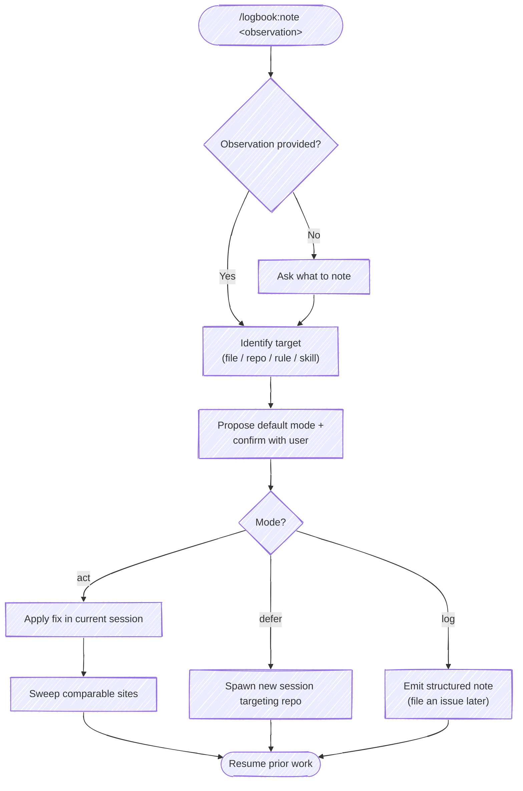

# `/logbook:note`

Make an entry in the logbook about something that isn't working well. The note is the primary act; what to *do* with it is a per-note choice.

A note pairs with `/logbook:retro` — retro reflects after the voyage, `note` captures mid-voyage. Once captured, the user picks one of three responses: act now, defer to a fresh session, or log only.



## Behavior

### 1. Capture

`$ARGUMENTS` is the observation. If empty, ask the user one question: *what should we note?*

### 2. Identify the target

From the observation, name the most likely target. Examples:

- "the sweep rule is too vague" → `~/.claude/rules/sweep-the-learnings.md` (which per the [ai-sdlc-is-source-of-truth](file:///Users/cpeterson/.claude/rules/ai-sdlc-is-source-of-truth.md) rule actually edits `~/src/getty/cpeterson/ai-sdlc/src/claude/rules/sweep-the-learnings.md`)
- "the retro skill should X" → `skills/retro/SKILL.md` in the current repo
- "this repo's CLAUDE.md is missing Y" → `CLAUDE.md` in the current working directory
- "the ai-sdlc recipe for debugging needs Z" → `recipes/debugging.md` in the ai-sdlc repo

If multiple targets are plausible, list the candidates and ask. Do not silently pick one.

### 3. Propose a default mode and confirm

Suggest a default based on the observation's shape:

| Default | When |
|---|---|
| `act` | Target is in the current working directory or under `~/.claude/` (sync hook reflects edits to ai-sdlc back to here). Change is small and well-scoped. The user is mid-task and the fix unblocks or tightens that task. |
| `defer` | Target is a different repo from the current working directory. Change is larger than a one-line edit, or requires its own test/commit cycle. The current session shouldn't be paused for it. |
| `log` | The observation isn't yet actionable — needs more thought, more data, or a teammate's input. Or the fix is real but the user wants to batch with similar work later. |

Present the suggestion in one line and let the user override:

```text
Target: ~/src/getty/cpeterson/ai-sdlc/src/claude/rules/sweep-the-learnings.md
Default: act (small wording fix, current session)
Proceed with [act] / defer / log?
```

### 4a. Mode: `act`

Apply the change in the current session. Then **sweep** — find comparable sites and apply the same learning. This is the ratchet: one observation raises the floor everywhere it fits, not just where it was noticed.

The user's [sweep-the-learnings](file:///Users/cpeterson/.claude/rules/sweep-the-learnings.md) rule governs how to sweep:

1. Name the learning precisely (the pattern, not the symptom).
2. Grep across comparable surfaces — sibling files, sibling artifacts, indexes, summary docs.
3. Decide per site: fix now, fix as a follow-up this session, file separately, or document why this site is intentionally different.
4. Report the result. Even "swept N sites, no other occurrences" is useful.

Surface a sweep summary before returning to prior work:

```text
Applied to: <primary path>
Swept N sites: <list>
```

Then resume the work the user was doing when the note was raised.

### 4b. Mode: `defer`

Spawn a new Claude session in a new iTerm tab, pointed at the target repo, pre-loaded with the observation. The current session continues uninterrupted.

Generalized from the original `ai-sdlc` skill — the target repo is now a parameter, not hardcoded.

Write the prompt to a temp file first (multi-line prompts break shell quoting if inlined):

```bash
TMPFILE=$(mktemp /tmp/logbook-note-XXXXXX.md)
cat > "$TMPFILE" <<'PROMPT'
You are editing the <repo-name> repository. The user has captured an observation
from a parallel session that needs to be addressed in this repo.

Observation: {observation}

Likely target: {target path, if known}

Instructions:
1. Read CLAUDE.md (if present) to understand the repo structure.
2. Locate the file(s) this applies to — if ambiguous, list the candidates and
   ask (the user can interact with you in this tab).
3. Make the targeted edit.
4. Sweep comparable sites in this repo for the same pattern.
5. Run the repo's test/lint task if one is obvious (e.g. `just test`).
6. Run /commit to stage and commit.

This is a one-off session. Drive toward /commit and exit to avoid context loss.
PROMPT
```

Open the tab:

```bash
osascript <<EOF
tell application "iTerm2"
    tell current window
        create tab with default profile
        tell current session of current tab
            write text "cd <repo-path> && claude < $TMPFILE ; rm $TMPFILE"
        end tell
    end tell
end tell
EOF
```

If iTerm2 is not available, print the command for the user to run manually:

```text
Run in a new terminal:
cd <repo-path> && claude < <TMPFILE path>
```

Do not wait for the spawned session. Confirm and resume:

```text
Opened tab targeting <repo-name>: {first 80 chars of observation}...
```

### 4c. Mode: `log`

Emit a structured note the user can review later or file as an issue. Today there is no reusable issue-filing skill; one may eventually live in `pwsh-forge`. For now, print the note as a fenced markdown block the user can copy:

```markdown
**Note** (YYYY-MM-DD): <one-line summary>

**Target:** <path or "TBD">

**Observation:** <full text>

**Why this matters:** <one or two sentences, if the user supplied them>

**Suggested action:** <if obvious — otherwise omit>
```

State explicitly that nothing has been changed and no session has been spawned. Resume prior work.

## Sweep guidance

The `act` mode is the high-leverage path. A note that becomes an inline fix plus a sweep raises the floor across the whole codebase in one shot — vs. `defer` (one repo, asynchronously) or `log` (zero repos, maybe never). Default to `act` when the target is reachable from the current session and the fix is small.

Conversely, do not force `act` for changes that legitimately need their own test/commit cycle in another repo. That's what `defer` is for.

## Examples

```text
/logbook:note the sweep rule should explicitly call out "report the result, even when zero sites match"
```

→ Target: `sweep-the-learnings.md`. Mode: `act` (small wording fix). Apply, then sweep other rules for the same gap.

```text
/logbook:note the ai-sdlc debugging recipe doesn't say when to bail on a rabbit hole
```

→ Target: `~/src/getty/cpeterson/ai-sdlc/recipes/debugging.md`. Mode: `defer` (different repo, needs its own test/commit). Spawn tab.

```text
/logbook:note something feels off about how /logbook:retro asks for the deliverable links — it sometimes prompts twice
```

→ Mode: `log` (needs reproduction first, not actionable yet). Emit the structured note.
