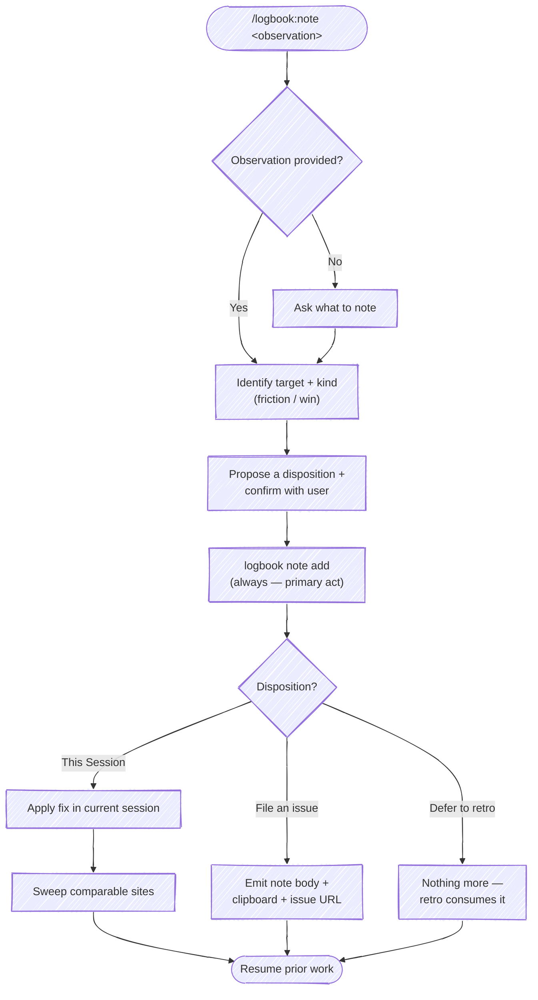
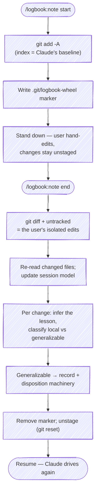

# `/logbook:note`

Record an observation about the session — friction *or* something that worked well — as **retro material**. logbook is a recorder: capturing the note is the primary act. What to *do* about it (the disposition) is metadata on the record.

Every note lands in the session's append-only notes log (`notes[]`), which `/logbook:retro` reads as pre-gathered material — so the retro confirms and expands what you flagged mid-session instead of reconstructing it cold. The note count is itself the signal for whether a session earned a retro.

A note pairs with `/logbook:retro` — retro reflects after the voyage, `note` captures mid-voyage. After recording, you pick a disposition:

| Disposition | When | What happens |
|---|---|---|
| **This Session** | The fix is reachable from here, small, and you want it now (you're blocked or want to leverage it) | apply the change + sweep comparable sites |
| **File an issue** | Worth tracking, but not now — you don't want to forget | emit a structured note + a pre-filled issue URL; nothing modified |
| **Defer to retro** | You recognize it but don't know how to handle it yet, or it's minor | nothing beyond the record; the retro picks it up |

Actuation that lives outside logbook's domain — spawning or forking a session into another project — is **not** logbook's job. When the work belongs in another repo and you want it now, file an issue and pull it into a fresh session there (e.g. `/recipe`), so that project's rules and hooks apply; or just open a session there. logbook records the note; the orchestration layer does the driving.

There are two ways to raise a note — same destination (`notes[]`), different input:

- **Describe it in prose** — `/logbook:note <observation>`: you say what's off (or what worked), and the skill records it and runs the disposition machinery below.
- **Demonstrate it by hand** — `/logbook:note start` … `/logbook:note end`: you take the wheel and edit files directly; `end` reads your isolated edits and harvests the lessons. The hand-edits *are* the observation. See [Hand-edit mode: take the wheel](#hand-edit-mode-take-the-wheel).



## Behavior

All CLI invocations run as:

```bash
python3 "${CLAUDE_PLUGIN_ROOT}/scripts/logbook" <subcommand> [args]
```

### 0. Dispatch on mode

Read the first token of `$ARGUMENTS`:

- `start` / `begin` (or a "take the wheel" phrasing — "I'm gonna drive", "let me drive") → **[Hand-edit mode → Start](#start-take-the-wheel)**.
- `end` / `done` / `refresh` (or "refresh context") → **[Hand-edit mode → End](#end-refresh-context)**.
- anything else, or empty → **prose observation**: continue at step 1.

### 1. Capture

`$ARGUMENTS` is the observation. If empty, ask the user one question: *what should we note?*

Infer the **kind** from the observation's tone — `friction` (something's off) or `win` (this worked well, capture it). Don't ask; it's a one-word tag.

### 2. Identify the target

From the observation, name the most likely target. Examples:

- "the sweep rule is too vague" → `~/.claude/rules/<rule-name>.md` (or, if a sync hook reflects edits from a source-of-truth repo, that repo's copy)
- "the retro skill should X" → `skills/retro/SKILL.md` in the current repo
- "this repo's CLAUDE.md is missing Y" → `CLAUDE.md` in the current working directory
- "the debugging playbook needs Z" → the relevant recipe/playbook file in whichever repo owns it

If multiple targets are plausible, list the candidates and ask. Do not silently pick one. A `win` note may have no single target — that's fine; leave it off.

### 3. Propose a disposition and confirm

Suggest a default based on the observation's shape:

| Default | When |
|---|---|
| `This Session` | Target is reachable from the current session (current working directory or a directory under `~/.claude/`). Change is small and well-scoped, and you want it now — you're blocked on it or want to leverage it for the work in flight. |
| `File an issue` | The fix is real and worth tracking, but not now. It may belong in another repo, or needs its own test/commit cycle. You don't want to forget it. |
| `Defer to retro` | You recognize the observation but don't yet know how to handle it, or it's minor. Or it's a `win` worth remembering. Just capture it; the retro will pick it up. |

Present the three dispositions as a selectable list with `AskUserQuestion`. Put the suggested default **first** with `(Recommended)` appended; the other two follow. State the resolved target (and kind) in the question text so the choice has context. Default toward `Defer to retro` when the note is a `win` or you're unsure — the recorder's common case is "capture and keep going."

- **header:** `Disposition`
- **question:** `Target: <path or "—">  (<kind>). What should happen with this note?`
- **options** (label → description):
  - `This Session` → apply the fix and sweep comparable sites right here
  - `File an issue` → emit a structured note + pre-filled issue URL to file for later
  - `Defer to retro` → just capture it; the end-of-session retro picks it up

The user can always pick "Other" to redirect. Reorder so the recommended option leads, but keep all three present.

### 4. Record the note (always)

Whatever the disposition, record it — this is the primary act, and it's what makes the note retro material:

```bash
python3 "${CLAUDE_PLUGIN_ROOT}/scripts/logbook" note add "<observation>" \
  --kind <friction|win> \
  --disposition <this-session|issue|deferred> \
  [--target <path>]
```

The CLI resolves the active session, captures the current transcript line ("where you are"), and appends the record to `~/.logbook/notes/<session-id>.jsonl`. Then carry out the disposition.

### 4a. Disposition: `This Session`

Apply the change in the current session. Then **sweep** — find comparable sites and apply the same learning. This is the ratchet: one observation raises the floor everywhere it fits, not just where it was noticed.

How to sweep:

1. Name the learning precisely (the pattern, not the symptom).
2. Grep across comparable surfaces — sibling files, sibling artifacts, indexes, summary docs.
3. Decide per site: fix now, fix as a follow-up this session, file separately, or document why this site is intentionally different.
4. Report the result. Even "swept N sites, no other occurrences" is useful.

Surface a sweep summary before returning to prior work:

```text
Applied to: <primary path>
Swept N sites: <list>
```

Then resume the work the user was doing when the note was raised.

### 4b. Disposition: `File an issue`

Emit a structured note the user can review, attach, or file as an issue. No file in the target repo is modified and no session is spawned. The skill produces three artifacts in one pass: a tempfile on disk, the body on the system clipboard, and (when the cwd is a git repo on a known forge) a pre-filled "new issue" URL.

**Title** — a short, specific phrase naming the change you want, in the imperative or as a statement of the desired end state. The issue already records its own date and the body carries the detail, so the title is just the headline. Keep it terse — aim for under ~60 characters and drop trailing qualifiers. Don't prefix it with `Note:` or a date.

**Body shape** — assemble these fields from the observation. No date line and no `**Note**` lead — the forge stamps the date, and the title is the summary:

```markdown
**Target:** <path or "TBD">

**Observation:** <full text>

**Why this matters:** <one or two sentences, if the user supplied them>

**Suggested action:** <if obvious — otherwise omit>
```

**Write to a tempfile.** Use `mktemp -u` with a unique template and a `.md` extension so the path doesn't collide with peer sessions and Cmd+click opens the registered editor. `-u` prints the name without creating the file, so the `Write` tool treats it as a fresh path — on macOS this sidesteps the "overwrite via a symlink" prompt that plain `mktemp` triggers (it pre-creates the file behind the `/tmp` → `/private/tmp` symlink). The flag is portable across BSD and GNU `mktemp`:

```bash
TMPFILE=$(mktemp -u /tmp/logbook-note.XXXXXX.md)
# Write the body to "$TMPFILE" via the Write tool, then reference $TMPFILE.
```

**Copy to clipboard** — best-effort, never erroring:

```bash
if   command -v pbcopy   >/dev/null; then pbcopy < "$TMPFILE"                    # macOS
elif command -v wl-copy  >/dev/null; then wl-copy < "$TMPFILE"                   # Wayland
elif command -v xclip    >/dev/null; then xclip -selection clipboard < "$TMPFILE" # X11
elif command -v clip.exe >/dev/null; then clip.exe < "$TMPFILE"                  # Windows / WSL
fi
```

Record whether at least one copy succeeded — surface "copied to clipboard" or "clipboard unavailable" in the summary.

**Build a "new issue" URL** when cwd is a git repo on a recognized forge. URL emission lives here; actually filing via `gh`/`glab` is deferred.

Detect the forge from `git remote get-url origin`:

| Host | URL template |
|---|---|
| `github.com` | `https://github.com/<owner>/<repo>/issues/new?title=<title>&body=<body>` |
| `gitlab.com` or any `gitlab.*` host | `https://<host>/<owner>/<repo>/-/issues/new?issue[title]=<title>&issue[description]=<body>` |

Strip a trailing `.git` from the repo segment. Both `title` and `body` must be URL-encoded (`%`, spaces → `%20`, newlines → `%0A`, etc.). If the cwd isn't a git repo, the origin isn't recognized, or the URL would exceed ~8 KB after encoding, omit the URL — print the file path and clipboard status only.

**Print a summary** — lead with the action. Render the prefilled issue URL as a markdown hyperlink with a short label, never the raw query string. Name the target repo so the user knows where the issue lands, link the note file, and note the clipboard in passing.

When a forge URL was built:

```text
Captured for <owner>/<repo> — nothing modified, no session spawned.
→ **[File the issue](<prefilled-url>)** · note: [logbook-note.<id>.md](file:///tmp/logbook-note.<id>.md) (copied to clipboard)
```

When no URL (cwd isn't a recognized forge repo, or the encoded URL was too long):

```text
Captured — nothing modified, no session spawned.
Note saved to [logbook-note.<id>.md](file:///tmp/logbook-note.<id>.md) (copied to clipboard); file it manually when ready.
```

If the clipboard copy failed, say `(clipboard unavailable)` in place of `(copied to clipboard)`.

To work it now in another repo, file the issue and pull it into a fresh session there (`/recipe`), so that project's rules and hooks apply. Then resume prior work.

### 4c. Disposition: `Defer to retro`

Nothing beyond the [step 4](#4-record-the-note-always) record. The note is now in `notes[]`; `/logbook:retro` will surface it at session end. Confirm and resume:

```text
Captured for the retro. <N> note(s) this session.
```

## Hand-edit mode: take the wheel

Most of the time the user lets Claude drive. Occasionally they want to take the wheel and hand-edit files — to correct a convention, fix something faster than describing it, or shape code the way they want it. This mode brackets that handoff so the edits don't just land silently: `end` reads them back, updates Claude's model for the rest of the session, and harvests the generalizable lessons into the same record/disposition path a prose note uses.

The bracket relies on one git trick. `start` stages everything as Claude's last-known baseline (`git add -A`), so the index *is* the baseline. The user's hand-edits then stay unstaged, and `git diff` (working tree vs index) shows **exactly** their edits — isolated from any uncommitted work Claude left behind. Without `start`, that isolation isn't possible and `end` says so.



### Start (take the wheel)

Triggered by `/logbook:note start`. Hand the wheel to the user.

1. **Confirm a git repo.** Run `git rev-parse --is-inside-work-tree`. If it isn't a repo, say so and stop — the bracket needs git to isolate the diff.
2. **Check for an open bracket.** If `.git/logbook-wheel` already exists, a bracket is already open. Tell the user when it was opened and re-baseline (re-stage and refresh the marker) rather than erroring.
3. **Stage the baseline.** `git add -A` — the index now reflects Claude's last-known state, including untracked files Claude created.
4. **Drop the marker.** Record that the bracket is open and when:

   ```bash
   date -u +%Y-%m-%dT%H:%M:%SZ > "$(git rev-parse --git-dir)/logbook-wheel"
   ```

   The marker lives in `.git/` — repo-local, never committed, and the deterministic signal `end` reads to know a bracket is open (rather than inferring it from index state).
5. **Stand down and report.** Tell the user the wheel is theirs:

   ```text
   Wheel is yours. Staged my work as the baseline (index = last-known state).
   Hand-edit freely — keep your changes unstaged. Run `/logbook:note end`
   (or say "refresh context") when you want me back.
   ```

   Then stop and wait. Do not make further edits while the bracket is open.

### End (refresh context)

Triggered by `/logbook:note end` (or "refresh context"). Take the wheel back, paying specific attention to what changed.

1. **Find the user's edits.**

   ```bash
   git diff                 # unstaged modifications to tracked files (vs the staged baseline)
   git status --porcelain   # untracked (??) files = wholly new, hand-written files
   ```

   Read the full content of every changed and new file — not just the diff hunks — so the session model reflects the current state, not a delta against a stale memory.

2. **Check isolation.** If `.git/logbook-wheel` is absent **and** nothing is staged (`git diff --cached --quiet` exits 0), `start` was never run, so the unstaged changes may include Claude's own uncommitted work. Say so and ask whether to proceed against everything unstaged or stop. Do not silently treat mixed changes as the user's edits.

   If there are no unstaged changes and no untracked files, there's nothing to harvest — report that and resume.

3. **Incorporate into the session.** State, concretely, what the edits change about how the rest of the session proceeds — a convention to follow, an approach to drop, a decision now settled. This is the "reload paying specific attention" step: the edits are now the source of truth, and Claude honors them going forward.

4. **Infer the lesson per change, and classify it.** For each meaningful edit, name *why* the user made it, then sort it:

   - **Local-only** — a one-off fix or preference specific to this spot, with nothing to generalize. Already applied (the user applied it by hand); just incorporate it and move on.
   - **Generalizable** — the edit demonstrates a rule, convention, or correction that applies elsewhere. This is a lesson worth recording and sweeping.

5. **Harvest the generalizable lessons.** Each one is an observation the user *demonstrated* instead of typed — route it through the same machinery: identify the target (step 2), record it (step 4), then propose a disposition (step 3) and act. The natural default here is **This Session** — the user is right here and just demonstrated the fix, so sweep comparable sites now. Use **File an issue** when the lesson is real but belongs to another repo or a later batch, and **Defer to retro** when it's worth remembering but not acting on now. When several lessons share one target, batch them into a single disposition decision rather than asking per lesson.

   Surface the harvest before acting so the user can steer:

   ```text
   Read your edits across <N> files. Incorporated into the session.
   Lessons:
     1. <lesson> — generalizable → propose This Session (sweep)
     2. <lesson> — local-only, incorporated, nothing to sweep
   ```

6. **Close the bracket.** Remove the marker and return to a unified working tree so the session resumes normally:

   ```bash
   rm -f "$(git rev-parse --git-dir)/logbook-wheel"
   git reset                # unstage the baseline; working tree (baseline + your edits) is untouched
   ```

   `git reset` (mixed) only clears the index — it changes nothing in the working tree and loses no work; everything the user and Claude did is still present, just unstaged. Report it so the state isn't a surprise:

   ```text
   Wheel's back with me. Unstaged the baseline — everything's in the working tree,
   nothing committed or lost. Picking up where we were.
   ```

## Disposition guidance

`This Session` is the high-leverage path. A note that becomes an inline fix plus a sweep raises the floor across the whole codebase in one shot — vs. `File an issue` (tracked, acted on later) or `Defer to retro` (captured, surfaced at session end). Choose `This Session` when the target is reachable from the current session and the fix is small and wanted now.

But the recorder's common case is lighter: most notes just get captured and the session keeps moving. Default to `Defer to retro` for wins and for anything you can't act on cleanly right now — the note is safely in `notes[]` either way, and the retro is where it compounds. Reach for `File an issue` when the work is real, belongs elsewhere or needs its own commit cycle, and you don't want to lose it.

logbook does not spawn or fork sessions. When acting now means working in another repo, file an issue and pull it into a session there (`/recipe`) so that project's context applies — that's the orchestration layer's job, not the recorder's.

## Examples

```text
/logbook:note the sweep rule should explicitly call out "report the result, even when zero sites match"
```

→ Kind: `friction`. Target: a sweep-related rule file under `~/.claude/rules/`. Disposition: `This Session` (small wording fix, reachable). Record, apply, then sweep other rules for the same gap.

```text
/logbook:note the AskUserQuestion two-option pattern worked really well for the disposition design here
```

→ Kind: `win`. No single target. Disposition: `Defer to retro` (worth remembering, nothing to act on). Record and resume.

```text
/logbook:note the debugging playbook doesn't say when to bail on a rabbit hole
```

→ Kind: `friction`. Target: the debugging recipe in a separate playbook repo. Disposition: `File an issue` (different repo, needs its own commit cycle). Record, emit the issue artifacts; pull it into a session there when ready.

```text
/logbook:note start
  ...user rewrites a helper to use the tenant-prefix convention by hand...
/logbook:note end
```

→ `start` stages the baseline and stands down. `end` reads the unstaged diff (the rewritten helper), incorporates the convention into the session, records the lesson, and harvests it — "helpers must apply the tenant prefix" — as a `This Session` sweep across the other helpers that miss it.
