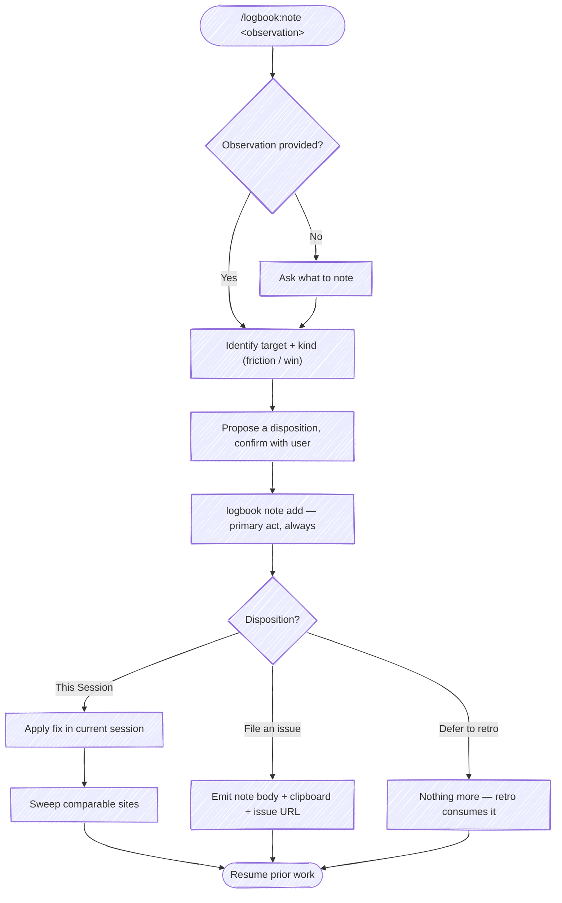

# `/logbook:note`

Record an observation about the session — friction *or* something that worked well — as **retro material**. logbook is a recorder: capturing the note is the primary act. What to *do* about it (the disposition) is metadata on the record.

Every note lands in the session's append-only notes log (`notes[]`), which `/logbook:retro` reads as pre-gathered material — so the retro confirms and expands what you flagged mid-session instead of reconstructing it cold. The note count is itself the signal for whether a session earned a retro.

A note pairs with `/logbook:retro` — retro reflects after the voyage, `note` captures mid-voyage. After recording, you pick a disposition:

| Disposition | When | What happens |
|---|---|---|
| **This Session** | The fix is reachable from here, small, and you want it now (you're blocked or want to leverage it) | apply the change + sweep comparable sites |
| **File an issue** | Worth tracking, but not now — you don't want to forget | emit a structured note + a pre-filled issue URL; nothing modified |
| **Defer to retro** | You recognize it but don't know how to handle it yet, or it's minor | nothing beyond the record; the retro picks it up |

Actuation that lives outside logbook's domain — spawning or forking a session into another project — is **not** logbook's job. When the work belongs in another repo and you want it now, file an issue and pull it into a fresh session there (e.g. `/recipe`), so that project's rules and hooks apply; or just open a session there. logbook records the note; the orchestration layer does the driving.

There are two ways to raise a note — same destination (`notes[]`), different input:

- **Describe it in prose** — `/logbook:note <observation>`: you say what's off (or what worked), and the skill records it and runs the disposition machinery below.
- **Demonstrate it by hand** — `/logbook:note start` … `/logbook:note end`: you take the wheel and edit files directly; `end` reads your isolated edits and harvests the lessons. The hand-edits *are* the observation. See [Hand-edit mode: take the wheel](#hand-edit-mode-take-the-wheel).



## Behavior

All CLI invocations run as:

```bash
python3 "${CLAUDE_PLUGIN_ROOT}/scripts/logbook" <subcommand> [args]
```

### 0. Dispatch on mode

Read the first token of `$ARGUMENTS`:

- `start` / `begin` (or a "take the wheel" phrasing — "I'm gonna drive", "let me drive") → **hand-edit mode**; read [`references/hand-edit-mode.md`](references/hand-edit-mode.md) and follow *Start*.
- `end` / `done` / `refresh` (or "refresh context") → **hand-edit mode**; read [`references/hand-edit-mode.md`](references/hand-edit-mode.md) and follow *End*.
- anything else, or empty → **prose observation**: continue at step 1.

### 1. Capture

`$ARGUMENTS` is the observation. If empty, ask the user one question: *what should we note?*

Infer the **kind** from the observation's tone — `friction` (something's off) or `win` (this worked well, capture it). Don't ask; it's a one-word tag.

### 2. Identify the target

From the observation, name the most likely target. Examples:

- "the sweep rule is too vague" → `~/.claude/rules/<rule-name>.md` (or, if a sync hook reflects edits from a source-of-truth repo, that repo's copy)
- "the retro skill should X" → `skills/retro/SKILL.md` in the current repo
- "this repo's CLAUDE.md is missing Y" → `CLAUDE.md` in the current working directory
- "the debugging playbook needs Z" → the relevant recipe/playbook file in whichever repo owns it

If multiple targets are plausible, list the candidates and ask. Do not silently pick one. A `win` note may have no single target — that's fine; leave it off.

### 3. Propose a disposition and confirm

Suggest a default based on the observation's shape:

| Default | When |
|---|---|
| `This Session` | Target is reachable from the current session (current working directory or a directory under `~/.claude/`). Change is small and well-scoped, and you want it now — you're blocked on it or want to leverage it for the work in flight. |
| `File an issue` | The fix is real and worth tracking, but not now. It may belong in another repo, or needs its own test/commit cycle. You don't want to forget it. |
| `Defer to retro` | You recognize the observation but don't yet know how to handle it, or it's minor. Or it's a `win` worth remembering. Just capture it; the retro will pick it up. |

Present the three dispositions as a selectable list with `AskUserQuestion`. Put the suggested default **first** with `(Recommended)` appended; the other two follow. State the resolved target (and kind) in the question text so the choice has context. Default toward `Defer to retro` when the note is a `win` or you're unsure — the recorder's common case is "capture and keep going."

- **header:** `Disposition`
- **question:** `Target: <path or "—">  (<kind>). What should happen with this note?`
- **options** (label → description):
  - `This Session` → apply the fix and sweep comparable sites right here
  - `File an issue` → emit a structured note + pre-filled issue URL to file for later
  - `Defer to retro` → just capture it; the end-of-session retro picks it up

The user can always pick "Other" to redirect. Reorder so the recommended option leads, but keep all three present.

### 4. Record the note (always)

Whatever the disposition, record it — this is the primary act, and it's what makes the note retro material:

```bash
python3 "${CLAUDE_PLUGIN_ROOT}/scripts/logbook" note add "<observation>" \
  --kind <friction|win> \
  --disposition <this-session|issue|deferred> \
  [--target <path>]
```

The CLI resolves the active session, captures the current transcript line ("where you are"), and appends the record to `~/.logbook/notes/<session-id>.jsonl`. Then carry out the disposition.

### 4a. Disposition: `This Session`

Apply the change in the current session. Then **sweep** — find comparable sites and apply the same learning. This is the ratchet: one observation raises the floor everywhere it fits, not just where it was noticed.

How to sweep:

1. Name the learning precisely (the pattern, not the symptom).
2. Grep across comparable surfaces — sibling files, sibling artifacts, indexes, summary docs.
3. Decide per site: fix now, fix as a follow-up this session, file separately, or document why this site is intentionally different.
4. Report the result. Even "swept N sites, no other occurrences" is useful.

Surface a sweep summary before returning to prior work:

```text
Applied to: <primary path>
Swept N sites: <list>
```

Then resume the work the user was doing when the note was raised.

### 4b. Disposition: `File an issue`

Emit a structured note the user can review, attach, or file as an issue — nothing in the target repo is modified and no session is spawned. In one pass the skill writes the note to a tempfile, copies the body to the clipboard, and (when the cwd is a git repo on a known forge) builds a pre-filled "new issue" URL. Lead the summary with the action, and render any issue URL as a markdown hyperlink, never the raw query string.

Read **[`references/file-an-issue.md`](references/file-an-issue.md)** before acting — it carries the full mechanics: title/body shape, the `mktemp -u` tempfile rationale, the clipboard fallback chain, forge URL templates and encoding rules, and the exact summary formats.

### 4c. Disposition: `Defer to retro`

Nothing beyond the [step 4](#4-record-the-note-always) record. The note is now in `notes[]`; `/logbook:retro` will surface it at session end. Confirm and resume:

```text
Captured for the retro. <N> note(s) this session.
```

## Hand-edit mode: take the wheel

Occasionally the user takes the wheel and hand-edits files directly — to correct a convention, fix something faster than describing it, or shape code the way they want it. `/logbook:note start` … `/logbook:note end` brackets that handoff so the edits don't land silently. `start` stages Claude's work as a git baseline (`git add -A`) so the user's hand-edits stay isolated in the unstaged diff; `end` reads those edits back, incorporates them into the session, and harvests the generalizable lessons through the same record/disposition machinery a prose note uses. The natural default at `end` is **This Session** — the user just demonstrated the fix, so sweep comparable sites now.

Read **[`references/hand-edit-mode.md`](references/hand-edit-mode.md)** before running either half — it carries the full *Start* and *End* procedures, the `.git/logbook-wheel` marker mechanism, and the isolation checks that keep the bracket safe when `start` was skipped.

## Disposition guidance

`This Session` is the high-leverage path. A note that becomes an inline fix plus a sweep raises the floor across the whole codebase in one shot — vs. `File an issue` (tracked, acted on later) or `Defer to retro` (captured, surfaced at session end). Choose `This Session` when the target is reachable from the current session and the fix is small and wanted now.

But the recorder's common case is lighter: most notes just get captured and the session keeps moving. Default to `Defer to retro` for wins and for anything you can't act on cleanly right now — the note is safely in `notes[]` either way, and the retro is where it compounds. Reach for `File an issue` when the work is real, belongs elsewhere or needs its own commit cycle, and you don't want to lose it.

logbook does not spawn or fork sessions. When acting now means working in another repo, file an issue and pull it into a session there (`/recipe`) so that project's context applies — that's the orchestration layer's job, not the recorder's.

## Examples

```text
/logbook:note the sweep rule should explicitly call out "report the result, even when zero sites match"
```

→ Kind: `friction`. Target: a sweep-related rule file under `~/.claude/rules/`. Disposition: `This Session` (small wording fix, reachable). Record, apply, then sweep other rules for the same gap.

```text
/logbook:note the AskUserQuestion two-option pattern worked really well for the disposition design here
```

→ Kind: `win`. No single target. Disposition: `Defer to retro` (worth remembering, nothing to act on). Record and resume.

```text
/logbook:note the debugging playbook doesn't say when to bail on a rabbit hole
```

→ Kind: `friction`. Target: the debugging recipe in a separate playbook repo. Disposition: `File an issue` (different repo, needs its own commit cycle). Record, emit the issue artifacts; pull it into a session there when ready.

```text
/logbook:note start
  ...user rewrites a helper to use the tenant-prefix convention by hand...
/logbook:note end
```

→ `start` stages the baseline and stands down. `end` reads the unstaged diff (the rewritten helper), incorporates the convention into the session, records the lesson, and harvests it — "helpers must apply the tenant prefix" — as a `This Session` sweep across the other helpers that miss it.
