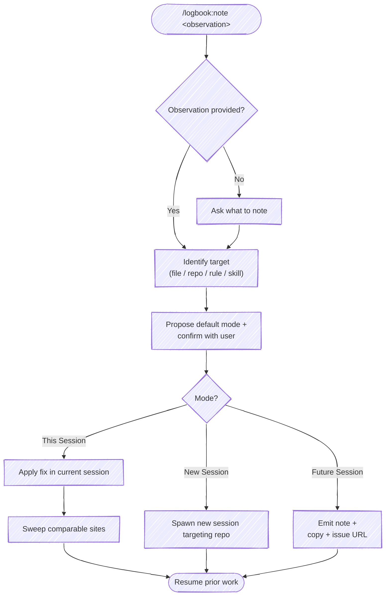

# `/logbook:note`

Make an entry in the logbook about something that isn't working well. The note is the primary act; what to *do* with it is a per-note choice.

A note pairs with `/logbook:retro` — retro reflects after the voyage, `note` captures mid-voyage. Once captured, the user picks one of three responses: **This Session** (apply + sweep here), **New Session** (spawn a fresh session to handle it in the background), or **Future Session** (capture it now; act in a later session).



## Behavior

### 1. Capture

`$ARGUMENTS` is the observation. If empty, ask the user one question: *what should we note?*

### 2. Identify the target

From the observation, name the most likely target. Examples:

- "the sweep rule is too vague" → `~/.claude/rules/<rule-name>.md` (or, if a sync hook reflects edits from a source-of-truth repo, that repo's copy)
- "the retro skill should X" → `skills/retro/SKILL.md` in the current repo
- "this repo's CLAUDE.md is missing Y" → `CLAUDE.md` in the current working directory
- "the debugging playbook needs Z" → the relevant recipe/playbook file in whichever repo owns it

If multiple targets are plausible, list the candidates and ask. Do not silently pick one.

### 3. Propose a default mode and confirm

Suggest a default based on the observation's shape:

| Default | When |
|---|---|
| `This Session` | Target is reachable from the current session (current working directory or a directory under `~/.claude/`). Change is small and well-scoped. The user is mid-task and the fix unblocks or tightens that task. |
| `New Session` | Target lives in a different repo from the current working directory. Change is larger than a one-line edit, or requires its own test/commit cycle. The current session shouldn't be paused for it. |
| `Future Session` | The observation isn't yet actionable — needs more thought, more data, or a teammate's input. Or the fix is real but the user wants to batch with similar work later. |

Present the three modes as a selectable list with `AskUserQuestion` so the user picks rather than types. Put the suggested default **first** and append `(Recommended)` to its label; the other two follow. State the resolved target in the question text so the choice has context.

- **header:** `Note action`
- **question:** `Target: <path>. How should this note be handled?`
- **options** (label → description):
  - `This Session` → apply the fix and sweep comparable sites right here
  - `New Session` → launch a fresh session to handle it in the background
  - `Future Session` → capture it now; act in a later session

The user can always pick "Other" to redirect (e.g. a different target, or "don't bother"). Reorder so the recommended option leads, but keep all three present regardless of the default.

### 4a. Mode: `This Session`

Apply the change in the current session. Then **sweep** — find comparable sites and apply the same learning. This is the ratchet: one observation raises the floor everywhere it fits, not just where it was noticed.

How to sweep:

1. Name the learning precisely (the pattern, not the symptom).
2. Grep across comparable surfaces — sibling files, sibling artifacts, indexes, summary docs.
3. Decide per site: fix now, fix as a follow-up this session, file separately, or document why this site is intentionally different.
4. Report the result. Even "swept N sites, no other occurrences" is useful.

Surface a sweep summary before returning to prior work:

```text
Applied to: <primary path>
Swept N sites: <list>
```

Then resume the work the user was doing when the note was raised.

### 4b. Mode: `New Session`

Spawn a new Claude session in a new iTerm tab, pointed at the target repo, pre-loaded with the observation. The current session continues uninterrupted.

Write the prompt to a temp file first (multi-line prompts break shell quoting if inlined):

```bash
TMPFILE=$(mktemp /tmp/logbook-note-XXXXXX.md)
cat > "$TMPFILE" <<'PROMPT'
You are editing the <repo-name> repository. The user has captured an observation
from a parallel session that needs to be addressed in this repo.

Observation: {observation}

Likely target: {target path, if known}

Instructions:
1. Read CLAUDE.md (if present) to understand the repo structure.
2. Locate the file(s) this applies to — if ambiguous, list the candidates and
   ask (the user can interact with you in this tab).
3. Make the targeted edit.
4. Sweep comparable sites in this repo for the same pattern.
5. Run the repo's test/lint task if one is obvious (e.g. `just test`).
6. Run /commit to stage and commit.

This is a one-off session. Drive toward /commit and exit to avoid context loss.
PROMPT
```

Open the tab:

```bash
osascript <<EOF
tell application "iTerm2"
    tell current window
        create tab with default profile
        tell current session of current tab
            write text "cd <repo-path> && claude < $TMPFILE ; rm $TMPFILE"
        end tell
    end tell
end tell
EOF
```

If iTerm2 is not available, print the command for the user to run manually:

```text
Run in a new terminal:
cd <repo-path> && claude < <TMPFILE path>
```

Do not wait for the spawned session. Confirm and resume:

```text
Opened tab targeting <repo-name>: {first 80 chars of observation}...
```

### 4c. Mode: `Future Session`

Emit a structured note the user can review, attach, or file as an issue. No file in the target repo is modified and no session is spawned. The skill produces three artifacts in one pass: a tempfile on disk, the body on the system clipboard, and (when the cwd is a git repo on a known forge) a pre-filled "new issue" URL.

**Body shape** — assemble these fields from the observation:

```markdown
**Note** (YYYY-MM-DD): <one-line summary>

**Target:** <path or "TBD">

**Observation:** <full text>

**Why this matters:** <one or two sentences, if the user supplied them>

**Suggested action:** <if obvious — otherwise omit>
```

**Write to a tempfile.** Use `mktemp` with a unique template and a `.md` extension so the path doesn't collide with peer sessions and Cmd+click opens the registered editor:

```bash
TMPFILE=$(mktemp /tmp/logbook-note.XXXXXX.md)
# Write the body to "$TMPFILE" via the Write tool, then reference $TMPFILE.
```

**Copy to clipboard** — best-effort, never erroring:

```bash
if   command -v pbcopy   >/dev/null; then pbcopy < "$TMPFILE"                    # macOS
elif command -v wl-copy  >/dev/null; then wl-copy < "$TMPFILE"                   # Wayland
elif command -v xclip    >/dev/null; then xclip -selection clipboard < "$TMPFILE" # X11
elif command -v clip.exe >/dev/null; then clip.exe < "$TMPFILE"                  # Windows / WSL
fi
```

Record whether at least one copy succeeded — surface "copied to clipboard" or "clipboard unavailable" in the summary.

**Build a "new issue" URL** when cwd is a git repo on a recognized forge. URL emission lives here; actually filing via `gh`/`glab` is deferred.

Detect the forge from `git remote get-url origin`:

| Host | URL template |
|---|---|
| `github.com` | `https://github.com/<owner>/<repo>/issues/new?title=<title>&body=<body>` |
| `gitlab.com` or any `gitlab.*` host | `https://<host>/<owner>/<repo>/-/issues/new?issue[title]=<title>&issue[description]=<body>` |

Strip a trailing `.git` from the repo segment. Both `title` and `body` must be URL-encoded (`%`, spaces → `%20`, newlines → `%0A`, etc.). If the cwd isn't a git repo, the origin isn't recognized, or the URL would exceed ~8 KB after encoding, omit the URL — print the file path and clipboard status only.

**Print a summary** — file path as a clickable hyperlink, clipboard status, URL (if any), and an explicit "no files in the target were modified" line:

```text
Logged note: [logbook-note.<id>.md](file:///tmp/logbook-note.<id>.md)
Clipboard: copied (pbcopy) | unavailable
Create issue: <forge URL, if any>

Nothing in the target was modified; no parallel session was spawned.
```

Then resume prior work.

## Sweep guidance

The `This Session` mode is the high-leverage path. A note that becomes an inline fix plus a sweep raises the floor across the whole codebase in one shot — vs. `New Session` (one repo, asynchronously) or `Future Session` (zero repos, maybe never). Default to `This Session` when the target is reachable from the current session and the fix is small.

Conversely, do not force `This Session` for changes that legitimately need their own test/commit cycle in another repo. That's what `New Session` is for.

## Examples

```text
/logbook:note the sweep rule should explicitly call out "report the result, even when zero sites match"
```

→ Target: a sweep-related rule file under `~/.claude/rules/`. Mode: `This Session` (small wording fix). Apply, then sweep other rules for the same gap.

```text
/logbook:note the debugging playbook doesn't say when to bail on a rabbit hole
```

→ Target: the debugging recipe in a separate playbook repo. Mode: `New Session` (different repo, needs its own test/commit). Spawn tab.

```text
/logbook:note something feels off about how /logbook:retro asks for the deliverable links — it sometimes prompts twice
```

→ Mode: `Future Session` (needs reproduction first, not actionable yet). Emit the structured note.
