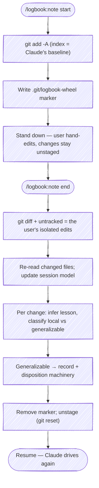

# Hand-edit mode: take the wheel

Loaded from `skills/note/SKILL.md` when the user runs `/logbook:note start` / `end` (or a "take the wheel" / "refresh context" phrasing).

Most of the time the user lets Claude drive. Occasionally they want to take the wheel and hand-edit files — to correct a convention, fix something faster than describing it, or shape code the way they want it. This mode brackets that handoff so the edits don't just land silently: `end` reads them back, updates Claude's model for the rest of the session, and harvests the generalizable lessons into the same record/disposition path a prose note uses.

The bracket relies on one git trick. `start` stages everything as Claude's last-known baseline (`git add -A`), so the index *is* the baseline. The user's hand-edits then stay unstaged, and `git diff` (working tree vs index) shows **exactly** their edits — isolated from any uncommitted work Claude left behind. Without `start`, that isolation isn't possible and `end` says so.



## Start (take the wheel)

Triggered by `/logbook:note start`. Hand the wheel to the user.

1. **Confirm a git repo.** Run `git rev-parse --is-inside-work-tree`. If it isn't a repo, say so and stop — the bracket needs git to isolate the diff.
2. **Check for an open bracket.** If `.git/logbook-wheel` already exists, a bracket is already open. Tell the user when it was opened and re-baseline (re-stage and refresh the marker) rather than erroring.
3. **Stage the baseline.** `git add -A` — the index now reflects Claude's last-known state, including untracked files Claude created.
4. **Drop the marker.** Record that the bracket is open and when:

   ```bash
   date -u +%Y-%m-%dT%H:%M:%SZ > "$(git rev-parse --git-dir)/logbook-wheel"
   ```

   The marker lives in `.git/` — repo-local, never committed, and the deterministic signal `end` reads to know a bracket is open (rather than inferring it from index state).
5. **Stand down and report.** Tell the user the wheel is theirs:

   ```text
   Wheel is yours. Staged my work as the baseline (index = last-known state).
   Hand-edit freely — keep your changes unstaged. Run `/logbook:note end`
   (or say "refresh context") when you want me back.
   ```

   Then stop and wait. Do not make further edits while the bracket is open.

## End (refresh context)

Triggered by `/logbook:note end` (or "refresh context"). Take the wheel back, paying specific attention to what changed.

1. **Find the user's edits.**

   ```bash
   git diff                 # unstaged modifications to tracked files (vs the staged baseline)
   git status --porcelain   # untracked (??) files = wholly new, hand-written files
   ```

   Read the full content of every changed and new file — not just the diff hunks — so the session model reflects the current state, not a delta against a stale memory.

2. **Check isolation.** If `.git/logbook-wheel` is absent **and** nothing is staged (`git diff --cached --quiet` exits 0), `start` was never run, so the unstaged changes may include Claude's own uncommitted work. Say so and ask whether to proceed against everything unstaged or stop. Do not silently treat mixed changes as the user's edits.

   If there are no unstaged changes and no untracked files, there's nothing to harvest — report that and resume.

3. **Incorporate into the session.** State, concretely, what the edits change about how the rest of the session proceeds — a convention to follow, an approach to drop, a decision now settled. This is the "reload paying specific attention" step: the edits are now the source of truth, and Claude honors them going forward.

4. **Infer the lesson per change, and classify it.** For each meaningful edit, name *why* the user made it, then sort it:

   - **Local-only** — a one-off fix or preference specific to this spot, with nothing to generalize. Already applied (the user applied it by hand); just incorporate it and move on.
   - **Generalizable** — the edit demonstrates a rule, convention, or correction that applies elsewhere. This is a lesson worth recording and sweeping.

5. **Harvest the generalizable lessons.** Each one is an observation the user *demonstrated* instead of typed — route it through the same machinery: identify the target, record it, then propose a disposition and act. The natural default here is **This Session** — the user is right here and just demonstrated the fix, so sweep comparable sites now. Use **File an issue** when the lesson is real but belongs to another repo or a later batch, and **Defer to retro** when it's worth remembering but not acting on now. When several lessons share one target, batch them into a single disposition decision rather than asking per lesson.

   Surface the harvest before acting so the user can steer:

   ```text
   Read your edits across <N> files. Incorporated into the session.
   Lessons:
     1. <lesson> — generalizable → propose This Session (sweep)
     2. <lesson> — local-only, incorporated, nothing to sweep
   ```

6. **Close the bracket.** Remove the marker and return to a unified working tree so the session resumes normally:

   ```bash
   rm -f "$(git rev-parse --git-dir)/logbook-wheel"
   git reset                # unstage the baseline; working tree (baseline + your edits) is untouched
   ```

   `git reset` (mixed) only clears the index — it changes nothing in the working tree and loses no work; everything the user and Claude did is still present, just unstaged. Report it so the state isn't a surprise:

   ```text
   Wheel's back with me. Unstaged the baseline — everything's in the working tree,
   nothing committed or lost. Picking up where we were.
   ```
